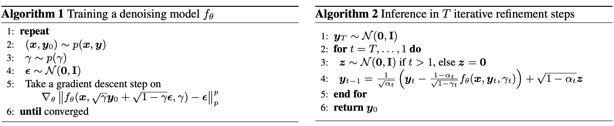

# Diffusion Denoising Probabilistic Model for CryoEM Super Resolution

## Forward Process

We start by defining a ratio:

$$\beta_t \in (0, 1)$$

$\beta_t$ usually start from 0.0001 and increase to 0.002, based on original paper. (Can be arbitrary).

Lets define input image as $x_0$, and $x_t$ is the output image after $t$ iterations of forward adding noise process, as follows:

$$x_t = \sqrt{\alpha_t} x_{t - 1} + \sqrt{1 - \alpha_t} z_t$$

where $z_t \sim \mathcal{N}(0, 1)$, and $\alpha_t = 1 - \beta_t$.

We know $x_t$ can be calculated iteratively from the previous $x_{t - 1}$, but it is very slow. Is there way to calculate $x_t$ directly from $x_0$?

Plug $x_{t - 1} = \sqrt{\alpha_{t - 1}} x_{t - 2} + \sqrt{1 - \alpha_{t - 1}} z_{t - 1}$ into previous equation, we have:

$$\begin{aligned}
x_t &= \sqrt{\alpha_t} \left(\sqrt{\alpha_{t - 1}} x_{t - 2} + \sqrt{1 - \alpha_{t - 1}} z_{t - 1}\right) + \sqrt{1 - \alpha_t} z_t\\
x_t &= \sqrt{\alpha_t \alpha_{t - 1}} x_{t - 2} + \left(\sqrt{\alpha_t(1 - \alpha_{t - 1})} z_{t - 1} + \sqrt{1 - \alpha_t} z_t\right)
\end{aligned}$$

Notice $z_t, z_{t - 1}, ... \sim \mathcal{N}(0, 1)$, thus they are indeed,

$$\begin{aligned}
\sqrt{\alpha_t(1 - \alpha_{t - 1})} z_{t - 1} &= \mathcal{N}(0, \alpha_t(1 - \alpha_{t - 1})) \\
\sqrt{1 - \alpha_t} z_t &= \mathcal{N}(0, 1 - \alpha_t)
\end{aligned}$$

This addition follows gaussian's law:

$$\mathcal{N}(0, \theta_1^2 \mathbf{I}) + \mathcal{N}(0, \theta_2^2 \mathbf{I}) \equiv \mathcal{N}(0, (\theta_1^2 + \theta_2^2) \mathbf{I})$$

Thus we have:

$$x_t = \sqrt{\alpha_t \alpha_{t - 1}} x_{t - 2} + \sqrt{1 - \alpha_t\alpha_{t - 1}} z$$

Doing the same thing iteratively, we have:

$$x_t = \sqrt{\bar \alpha_t} x_{0} + \sqrt{1 - \bar\alpha_t} z$$

where $\bar\alpha_t = \prod_{i = 1}^t \alpha_i$.

**We can see that $x_t$ can be calculated directly from $x_0$ and $z$.**

(This is important because $t$ usually goes up to $1000$, and for every iteration during training, we need to calculate a new $x_t$.)

## Reverse Process

First step in the reversing process, What we are calculating? how?

By bayes rule, we have:

$$q(x_{t - 1}|x_{t}) = q(x_{t}|x_{t - 1}) \frac{q(x_{t - 1})}{q(x_{t})}$$

However, we don't know $q(x_{t - 1}), q(x_{t})$ out of thin air. Instead, we know they are derived from $x_0$, thus we have:

$$q(x_{t - 1}|x_{t}, x_0) = q(x_{t}|x_{t - 1}, x_0) \frac{q(x_{t - 1}|x_0)}{q(x_{t}|x_0)}$$

Each term on the right hand side can be calculated as follows:

$$\begin{aligned}
q(x_{t - 1}|x_0) &= \sqrt{\bar \alpha_{t - 1}} x_{0} + \sqrt{1 - \bar\alpha_{t - 1}} z &&\sim \mathcal{N}(\sqrt{\bar \alpha_{t - 1}} x_{0}, 1 - \bar\alpha_{t - 1}) \\
q(x_{t}|x_0) &= \sqrt{\bar \alpha_{t}} x_{0} + \sqrt{1 - \bar\alpha_{t}} z  &&\sim \mathcal{N}(\sqrt{\bar \alpha_{t}} x_{0}, 1 - \bar\alpha_{t}) \\
q(x_{t}|x_{t - 1}, x_0) &= \sqrt{\alpha_t} x_{t - 1} + \sqrt{1 - \alpha_t} z  &&\sim \mathcal{N}(\sqrt{\alpha_t} x_{t - 1}, 1 - \alpha_t) \\
\end{aligned}$$

Prior knowledge:

$$\mathcal{N}(\mu, \sigma) = \frac{1}{\sigma \sqrt{2\pi} } e^{-\frac{1}{2}\left(\frac{x-\mu}{\sigma}\right)^2}$$

**(Heavy Math)** Lets simplify the equation. We want to find the distribution of the first timestamp in the reverse process, $q(x_{t - 1}|x_{t})$:

$$\begin{aligned}
&\propto exp\left(-\frac{1}{2}\left(\frac{(x_t - \sqrt{\alpha_t} x_{t - 1})^2}{1 - \alpha_t} + \frac{(x_{t - 1} - \sqrt{\bar \alpha_{t - 1}} x_{0})^2}{1 - \bar\alpha_{t - 1}} - \frac{(x_{t} - \sqrt{\bar \alpha_{t}} x_{0})^2}{1 - \bar\alpha_{t}}\right)\right) \\
&= exp\left(-\frac{1}{2}\left(\frac{x_t^2 - 2\sqrt{\alpha_t} x_t\mathbin{\color{blue}{x_{t - 1}}} + \alpha_t \color{red}{x_{t - 1}^2}}{1 - \alpha_t} + \frac{\mathbin{\color{red}{x_{t - 1}^2}} - 2\sqrt{\bar \alpha_{t - 1}}\mathbin{\color{blue}{x_{t - 1}}}x_{0} + \bar\alpha_{t - 1}x_{0}^2}{1 - \bar\alpha_{t - 1}} - \frac{x_{t}^2 - \sqrt{\bar \alpha_{t}}x_{t}x_{0} + \bar \alpha_{t}x_{0}^2}{1 - \bar\alpha_{t}}\right)\right) \\
\end{aligned}$$

$$\begin{aligned}
&= exp\left(-\frac{1}{2}\left(\mathbin{\color{red}{\left(\frac{\alpha_t}{1 - \alpha_t} + \frac{1}{1 - \bar\alpha_{t - 1}}\right) x_{t - 1}^2}} - \mathbin{\color{blue}{\left(\frac{2\sqrt{\alpha_t}}{1 - \alpha_t}x_{t} + \frac{2\sqrt{\bar \alpha_{t - 1}}}{1 - \bar\alpha_{t - 1}}x_{0}\right) x_{t - 1}}} - \frac{x_t^2}{1 - \alpha_t} + \frac{\bar\alpha_{t - 1}x_{0}^2}{1 - \bar\alpha_{t - 1}} - \frac{x_{t}^2 - \sqrt{\bar \alpha_{t}}x_{t}x_{0} + \bar \alpha_{t}x_{0}^2}{1 - \bar\alpha_{t}}\right)\right) \\
&= exp\left(-\frac{1}{2}\left(\mathbin{\color{red}{\left(\frac{\alpha_t}{1 - \alpha_t} + \frac{1}{1 - \bar\alpha_{t - 1}}\right) x_{t - 1}^2}} - \mathbin{\color{blue}{\left(\frac{2\sqrt{\alpha_t}}{1 - \alpha_t}x_{t} + \frac{2\sqrt{\bar \alpha_{t - 1}}}{1 - \bar\alpha_{t - 1}}x_{0}\right) x_{t - 1}}} + C(x_t, x_0)\right)\right) \\
\end{aligned}$$

The expanded formula is:

$$exp\left(-\frac{1}{2}\left(\frac{x-\mu}{\sigma}\right)^2\right) = exp\left(-\frac{1}{2}\left(\mathbin{\color{red}{\frac{1}{\sigma^2} x^2}} - \mathbin{\color{blue}{\frac{2\mu}{\sigma^2}x}} + \frac{\mu^2}{\sigma^2}\right)\right)$$

Apparently, we know $\sigma_t^2$ already. Lets rearrange to get $\mu$:

$$\mu_t(x_t, x_0) = \frac{\sqrt{\alpha_t}(1 - \bar\alpha_{t - 1})}{1 - \bar\alpha_{t}}x_t + \frac{\sqrt{\bar\alpha_{t - 1}}(1 - \alpha_t)}{1 - \bar\alpha_{t}}x_0$$

We don't know $x_0$, it is the final result we are looking for during the reverse process. However, we can rearrange previous equation to get $x_0$:

$$x_{0} = \frac{1}{\sqrt{\bar \alpha_t}}(x_{t} - \sqrt{1 - \bar\alpha_t} z)$$

Finally:

$$\begin{aligned}
\mu_t &= \frac{\sqrt{\alpha_t}(1 - \bar\alpha_{t - 1})}{1 - \bar\alpha_{t}}x_t + \frac{\sqrt{\bar\alpha_{t - 1}}(1 - \alpha_t)}{1 - \bar\alpha_{t}}\frac{1}{\sqrt{\bar \alpha_t}}(x_{t} - \sqrt{1 - \bar\alpha_t} z) \\
&= \frac{\alpha_t - \bar\alpha_{t}}{\sqrt{\alpha_t}(1 - \bar\alpha_{t})}x_t + \frac{1 - \alpha_t}{\sqrt{\alpha_t}(1 - \bar\alpha_{t})}(x_{t} - \sqrt{1 - \bar\alpha_t} z) \\
&= \frac{\alpha_t  - \alpha_t + (1 - \bar\alpha_{t})}{\sqrt{\alpha_t}(1 - \bar\alpha_{t})}x_t - \frac{1 - \alpha_t}{\sqrt{\alpha_t}\sqrt{1 - \bar\alpha_t}}z \\
&= \frac{1}{\sqrt{\alpha_t}} \left(x_t - \frac{1 - \alpha_t}{\sqrt{1 - \bar\alpha_t}}z \right) \\
\end{aligned}$$

**$z$ is the noise $\in \mathcal{N}(0, 1)$ which we don't know, and it is the thing we want to predict. The task of Diffusion Denoising Probabilistic Model is to train a model (UNet $f_\theta$) to predict $z$ given $x_t$.**

### Summarize

We iteratively "reverse the noise" as following to get $x_0$:

$$\begin{aligned}
q(x_{t - 1}|x_{t}) \sim \mathcal{N}(\mu_t, \sigma_t^2) &= \mu_t + \sigma_t z \\
&= \frac{1}{\sqrt{\alpha_t}} \left(x_t - \frac{1 - \alpha_t}{\sqrt{1 - \bar\alpha_t}}f_\theta(x_t, t) \right) + \sigma_t z\\
\end{aligned}$$

Technically, this process is reversing the noise. However, it is indeed a **generative process**. Thats why it is generally known as **Diffusion Generative Model**.

## Algorithm

### DDPM

### SR3

### The Core Model

We modify this model to make it more suitable for our task.

### Example

### CryoEM Super Resolution

## In construction

